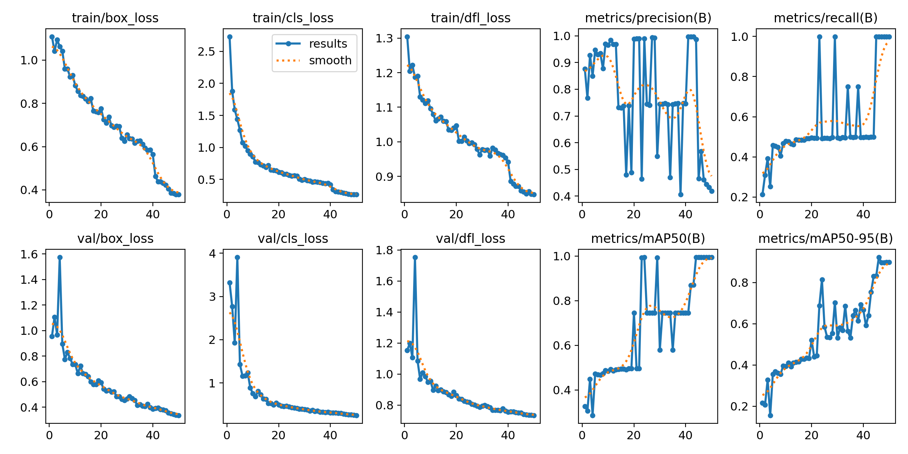

# Driver-behaviour-detection-yolov8
YOLOv8 based driver behaviour detection with real-time inference

# Driver Behaviour Detection using YOLOv8
This project performs real-time driver activity detection using Ultralytics YOLOv8.

## Activities Detected
- Mobile phone usage
- Drinking water
- Eating
- Smoking

## Features
- Real-time webcam inference
- Image inference
- Bounding box visualization

## Sample Output

## Run
pip install -r requirements.txt
python infer_webcam.py
python infer_image.py
